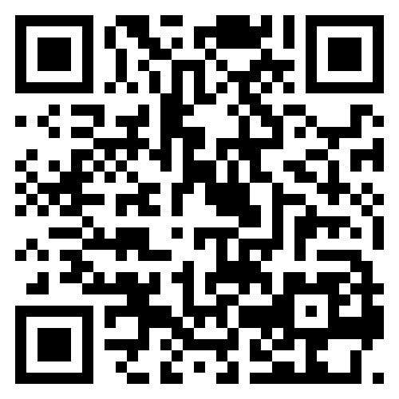
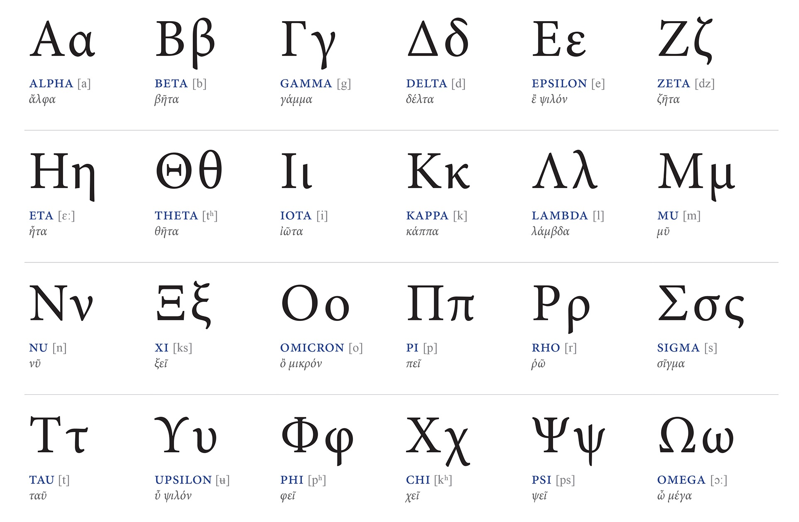
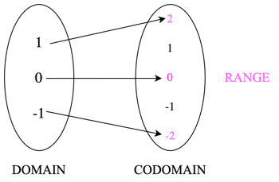
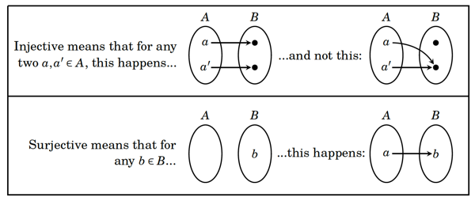
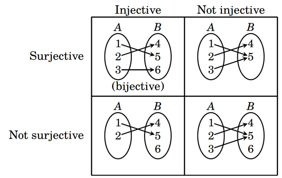

## Getting ready

```{r setup, include = FALSE}
library(tidyverse)
library(tinytable)

knitr::opts_chunk$set(fig.pos = "center", echo = TRUE, 
               message = FALSE, warning = FALSE)
```

- Set up [eduroam](https://services.northwestern.edu/TDClient/30/Portal/KB/ArticleDet?ID=1851)

- Go back and make sure you have the MOST RECENT version of R and RStudio

    - **R:** 4.6.1 (Happy Hop)
    - **RStudio:** 2026.08.2 

::: aside
See [gustavodiaz.org/NUmathcamp](https://gustavodiaz.org/NUmathcamp/) for materials
::::

{.absolute bottom=0 right=0 width="250" height="250"}

::: {style="text-align: center"}
##  Notation, Sets, Functions {.center}

NU Social Science Math Camp

:::

## Agenda


- **Morning:** Notations, sets, functions
- **Lunch:** Meet new faculty
- **Afternoon:** Tidyverse I

## What is notation?


::: incremental
- Symbols, letters, formulae used over plain language
- **Goal:** Talk about stuff in general terms
- **Downside:** Harder to follow
- **Conjecture:** Math is not hard, its *language* is
- **Solution:** Practice
:::

<!-- . . . -->

<!-- {fig-align="center"} -->

## Set Notation

**Set:** A collection of elements

. . .

**Numerical sets**

::: incremental
- $\mathbb{N}$: Natural numbers &nbsp; $\{(0), 1, 2, 3\}$
- $\mathbb{Z}$: Integers &nbsp; $\{\ldots, -3, -2, -1, 0, 1, 2, 3, \ldots\}$
- $\mathbb{Q}$: Rational numbers &nbsp; $\{1/2, 3/2, 4\}$
<!-- Can be represented as ratio of two integers -->
- $\mathbb{R}$: Real numbers &nbsp; $\{-899.8, 22, 4.5, \pi, e\}$
- $\mathbb{R}^2$: 2-dimensional space 
- $\mathbb{R}^3$: 3-dimensional space

:::

## Measurement

. . .

Sets can also have non-numerical elements

. . .

$$
\mathbb{A} = \{\text{Spain}, \text{Argentina}, \text{England}, \text{France} \} 
$$

. . .

We can *treat* these as numbers or not, what matters is what we assume about the elements

::: incremental
- **Nominal:** No mathematical relationship between elements
- **Ordinal:** Order is meaningful
- **Interval:** Elements equidistant, but no meaningful zero
- **Ratio (interval-ratio)**: There is a meaningful zero
:::


<!-- Ask/give examples -->

## Set notation

. . .

Elements of a set

::: incremental
- Capital letters denote a set $A$

- Lowercase denotes an *arbitrary* element of a set $a$

:::

## Set notation

Bracketing

. . .

:::: {.columns}

::: {.column width="33%"}
$[ \text{ }]$: Brackets
:::

::: {.column width="33%"}
$( \text{ } )$: Parentheses (round brackets)
:::

::: {.column width="33%"}
$\{\}$: Braces<br>(curly brackets)
:::

:::: 

. . .

Uses vary, but generally...

::: incremental
- **Brackets** are for *continuous* sets $[0, 1]$

- **Parentheses** are for *exclusive* sets $(0,1)$

- Can mix and match like $[0,1)$

- **Braces** are for *discrete* sets $\{0,1\}$
:::


## Set notation

. . .

Operations *within* sets

::: incremental
- $\exists$   "exists"; there is something true
- $\forall$   "for all"; for every element
- $\in$   "in" or "element of"
- \|   Such that (specify a condition)
- $\notin$  "not in", excluding element(s) 
- $\equiv$ equivalent
:::

## Set notation

Operations *between* sets

::: incremental
- $\subset$; $\subseteq$  Subset
- $\varnothing$  Empty set
- $\cap$  Intersection; AND
- $\cup$  Union; OR
- $\setminus$  Difference
:::

## Practice

::: incremental
- $x \in \mathbb{Z}$
- $\{x|x \in \mathbb{N}, x < 4\}$
- $\{x|x \in \mathbb{R}, x < 200\}$
- $\{ai | a \in \mathbb{R}, i= \sqrt{-1}\}$ <!-- Definition of a pure imaginary number -->
- $A \cap B$
- $A \cup B$
- $\{4n \in \mathbb{N} | n \in \mathbb{N}\}$
:::

<!-- Do more practice with empty, union, intersecting sets -->


## Greek notation

. . .

{fig-align="center" width="90%"}

## Greek vs. Latin

:::: {.columns}

::: {.column width="50%"}
### Greek

- Letters like $\mu$ denote **parameters** or **quantities of interest**

- Markings like $\widehat{\mu}$ denotes our **estimate** of such parameters/quantities

:::

::: {.column width="50%"}
### Latin

- Letters like $X$ denote **variables** in our data


- Markings like $\bar{X}$  denotes **calculations** from our data

:::

::::


::: {style="text-align: center"}

$X \rightarrow \bar{X} \rightarrow \widehat{\mu} \xrightarrow{\text{hopefully!}} \mu$
:::

## Another way to think about it

**Variables** are denoted by Latin letters like $x, y, z$

. . .

**Constants** are denoted by Latin letters $a, b, c$

. . .

- Variables and constants appear in a spreadsheet

&nbsp;

. . .

**Parameters** are denoted by Greek letters $\alpha, \beta, \gamma$

::: incremental
- Parameters are *theoretical* quantities
- May map to constants or variables (but need not to)
:::

# Questions?

# What else?

## Arithmetic operations

**Addition:** $2+3 = 5$

**Subtraction:** $2-3 = -1$

**Multiplication:** $2 \times 3 = 2 \ast 3 = 2 \cdot 3 = 6$

**Division:** $2 \div 3 = 2/3 = \frac{2}{3} = 0.\bar{6}$

**Exponentiation:** $2^3 = 2 \hat{} 3 = 8$

**Square root:** $\sqrt{x}$

**Logarithm:** $\log_a(x)$

**Natural logarithm:** $log_e(x) = ln(x) \approx log(x)$

## With many elements

. . .


**Summation** 

$$
\sum_i^n x_i = x_1 + x_2 + x_3 + \ldots + x_n
$$

. . .

**Product**

$$
\prod_i^n x_i = x_1 \cdot x_2 \cdot x_3 \cdot \ldots \cdot x_n
$$


## Order of operations

**P**arentheses  
**E**xponents  
**M**ultiplication  
**D**ivision  
**A**ddition  
**S**ubtraction  

. . .

This sounds trivial but it's very important when coding!

## Order of operations

**PEMDAS**

. . .

<!-- Do it in the whiteboard. Answer is -93 -->

$$
(3+7)^2 (2+3) / (1-6)
$$

. . .

$$
= -93
$$


# Functions

## What is a function?

**Informally:** Anything that takes an input and produces an output

. . .

Three main parts:

::: incremental
1. Input
2. Relationship of interest (operations)
3. Output
:::

---

{fig-align="center"}


## Example

$$
f(x) = 3x + 4
$$


::: incremental
- $x$ is the *input* (value or domain)
- $3x + 4$ is the *relationship*
- $f(x)$ is the output (range)
:::

. . .

Can also write

$$
y = 3x + 4
$$

Because "$y$ is a function of $x$"

## Example

$$
f(x) = 3x + 4
$$


- $x$ is the *input* (value or domain)
- $3x + 4$ is the *relationship*
- $f(x)$ is the output (range)


Can also write

$$
y = 3x + 4
$$

Because "$y$ is a function of $x$" $\Rightarrow$ $y = f(x)$

## Parts of a function {.nostretch}

{width=70% fig-align="center"}

## Types of functions

<!-- injective, surjective, bijective -->

. . .

- **Injective:** Every value of *domain* maps to a different value in *codomain*

. . .

- **Surjective:** Every in value in *codomain* maps to a different value in *domain*

. . .

{fig-align="center"}

## Types of functions

- **Bijective:** Both injective *and* surjective

. . .

{fig-align="center"}

. . .

The important part is to remember *different mappings* exist


## Functions in R

```{r, eval=FALSE}
function(arguments){operation}
```

. . .


```{r}
f = function(x){x * 2}
```

. . .


```{r}
f(x = 5)
```

. . .

We can omit argument names and R will assume they come in order:

```{r}
f(5)
```

. . .

If the operation works with vectors, the function will too:

```{r}
f(1:10)
```

## Practice

The formula for the area of a circle is 

$$
A = \pi r^2
$$

Write a custom function that calculates the area based on the radius

. . .

**Answer:**

```{r}
A = function(r){pi * r^2}

A(3)
```

## Multiple arguments

```{r}
product = function(a, b){a*b}
```

. . .

```{r}
product(2, 3)
```

. . .

```{r}
product(a = 1:5, b = 2)
```

. . .

Vector recycling:

```{r}
product(a = 1:5, b = 1:2)
```

. . .

This may allow some operations that are not admissible in math

## Non-numeric inputs

```{r}
some_people = function(name){paste("Some people call me", name)}
```

. . .

```{r}
call_me = c(
  "the space cowboy",
  "the gangster of love",
  "Maurice"
)
```

. . .

```{r}
some_people(call_me)
```

::: aside
[The Joker -- Steve Miller Band (1973)](https://youtu.be/q3mfENm6VJc?si=P7rzxOy_mgVNRjgn)
:::

## Common functions

::: incremental
- **Linear:** $y=mx + b$
- **Quadratic:** $y = ax^2 + bx + c$
- **Cubic:** $y = ax^3 + bx^2 + cx + d$
- **$n$th order polynomial:** $y = ax^n + bx^{n-1} +  \ldots + c$
:::

. . .

These are still **linear combinations** because they are *linear* in *parameters*

## Composite functions

Functions that take other functions as inputs

. . .

Exterior function:

$$
f(x) = x^2
$$

. . .

Interior function:

$$
g(x) = x-3
$$

. . .

Composite:

$$
f(g(x)) = (x-3)^2
$$

## Composite functions in R

```{r}
f = function(x){x^2}
g = function(x){x-3}
```

. . .

```{r}
f(g(5))
```

. . .

We can write this in `tidyverse` form:

```{r}
5 %>% g() %>% f()
```

. . .

Which recently got its own base R version:

```{r}
5 |> g() |> f()
```
. . .

**Practice:** Do $g(f(5))$ by hand and then in R
