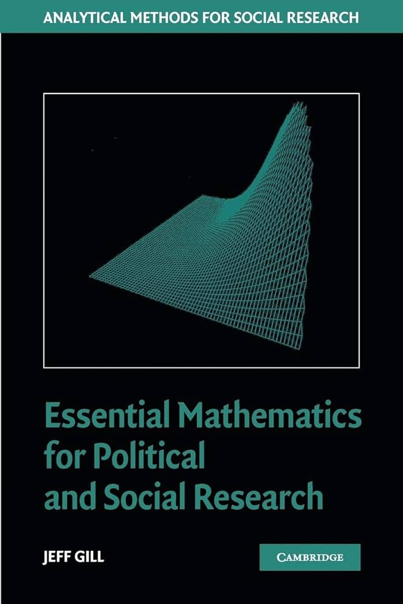
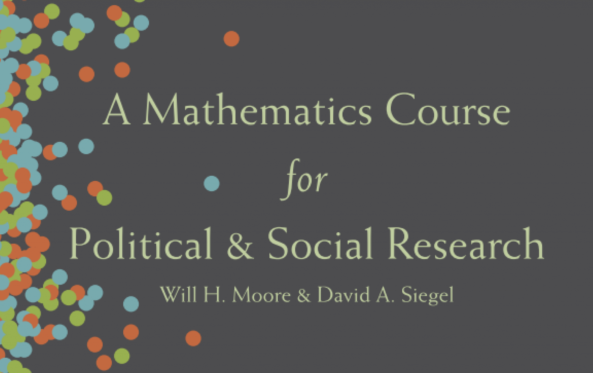
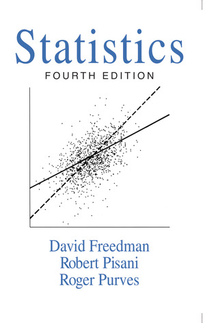
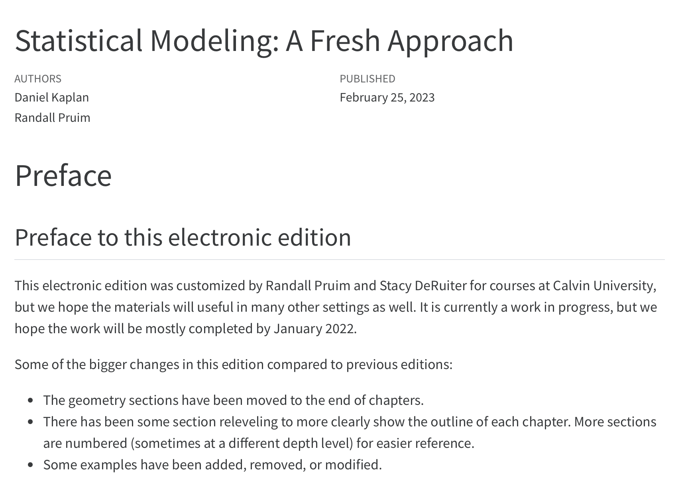

## Agenda

```{r setup, include = FALSE}
library(tidyverse)
library(tinytable)

knitr::opts_chunk$set(fig.pos = "center", echo = TRUE, 
               message = FALSE, warning = FALSE)
```


- **Morning:** Further learning and review
- **Lunch:** Meet grad students on the market
- **Afternoon:** Markdown


# Further learning

## Math camp reference

{fig-align="center" width=33%}

::: aside
[doi.org/10.1017/CBO9780511606656](https://doi.org/10.1017/CBO9780511606656) (free via NU Library)
:::

## Math camp reference


{fig-align="center" width=50%}

**Website:** [www.daveasiegel.com/teaching/math-course/](https://www.daveasiegel.com/teaching/math-course/)

**Youtube:** [www.youtube.com/c/DavidSiegelmath/playlists](https://www.youtube.com/c/DavidSiegelmath/playlists)

## Tidyverse

**Book:** [r4ds.hadley.nz](https://r4ds.hadley.nz)

**Short guides:** [posit.cloud/learn/recipes](https://posit.cloud/learn/recipes)

**Cheatsheets:** [posit.co/resources/cheatsheets/](https://posit.co/resources/cheatsheets/)

## Textbooks

{fig-align="center"}

## Textbooks

<!-- Imai WW -->

{fig-align="center"}

## Textbooks

<!-- MOSAIC -->
{fig-align="center" width="70%"}

::: aside
[statistical-modeling.netlify.app](https://statistical-modeling.netlify.app)
:::

## Courses in Political Science

**Core sequence:** Prob & Stats, Linear Models, Causal Inference

**2025-26 Electives**

- Small N (F)
- Experiments (F)
- Machine Learning (W)
- Replication (S)


## Courses in Sociology

**Core sequence:** Stats & Software, Linear Regression, Categorical Regression

**2025-26 Electives**

- Small N (F) 
- Computational Methods (F)
- Content Analysis (W)
- Qualitative Data Collection (S)

## Year-long workshops

**SOCIOL 576:** Quantitative and Computational Methods Workshop

**POLI_SCI 490:** Statistical Computing Workshop (fka R Workshop)

- .33 credit each quarter
- Can participate in both without getting credit

## Ad-hoc MS in Applied Statistics

- 9 courses + culminating project

-  Statistical Theory and Methods sequence required (STAT 320-1 and -2)

- **Concentration:** Stats only, data science, outside course

- Apply before or shortly after taking courses


- Awarded simultaneously with PhD

::: aside
[statistics.northwestern.edu/graduate/ad-hoc-ms-degree/](https://statistics.northwestern.edu/graduate/ad-hoc-ms-degree/)
:::

# Questions?

## How much of math camp will matter?

**Math**

::: incremental
- Mostly at a conceptual level (unless you do formal theory)

- Confidence in *soft* skills
:::

. . .

**R**


::: incremental
- Solid foundation to stay up to date with both coding and methods

- Easy to learn Python later if you need to
:::

# Review

